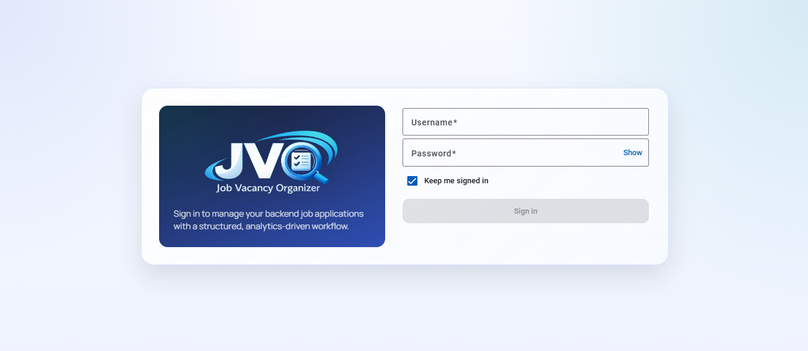
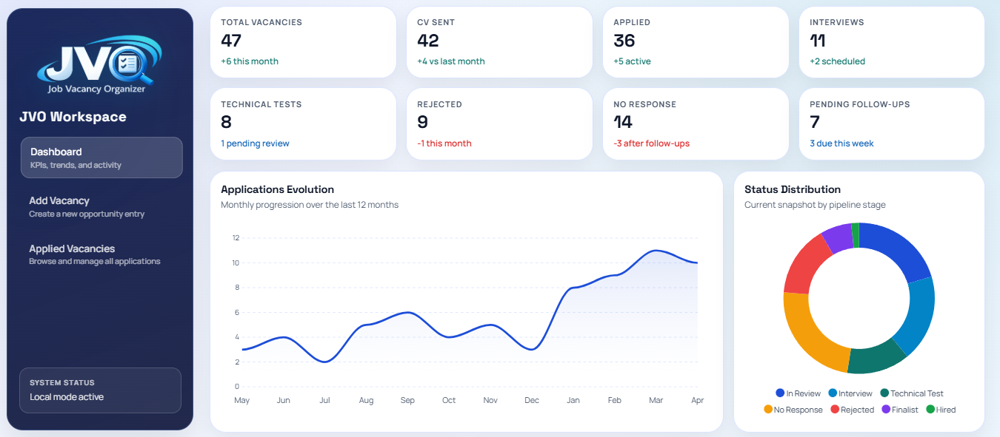

# Job Vacancy Organizer

<p align="center">
  
</p>

A portfolio-grade Angular SaaS-style web app to manage backend job applications with analytics, workflow tracking, and local-first persistence.

## Project Goals

- Track backend job opportunities end-to-end.
- Visualize progress with a premium analytics dashboard.
- Manage application lifecycle states, priorities, notes, and follow-ups.
- Import existing opportunities from Excel (`.xlsx`) using your current column format.
- Keep architecture ready for future migration to Firebase Authentication + Firestore.

## Tech Stack

- Angular 20 (standalone components, strict TypeScript)
- Reactive Forms
- Angular Material
- ApexCharts (`ng-apexcharts`)
- Local persistence (`localStorage` / `sessionStorage`)
- Excel import (`xlsx`)

## Architecture

```text
src/
  app/
    core/
      auth/
      guards/
      models/
      services/
    features/
      auth/
      dashboard/
      vacancies/
    layout/
    shared/
  assets/
    mocks/
  environments/
```

### Data Layer Design

- `VacancyRepository` interface + injection token decouples data access from feature UI.
- `LocalVacancyRepository` is the current concrete implementation.
- Seeder runs at startup through `APP_INITIALIZER`.
- This structure allows replacing local storage with Firestore repository later without rewriting pages.

## Implemented Phases

- Phase 1: project structure and routing foundations
- Phase 2: global premium visual theme
- Phase 3: responsive SaaS shell layout
- Phase 4: premium local login with validation and guards
- Phase 5: advanced dashboard (KPIs, charts, panels, animations)
- Phase 6: vacancy model + realistic seed + repository abstraction
- Phase 7: full vacancy CRUD + Excel import action
- Phase 8: advanced filters, sorting, and pagination
- Phase 9: README + Firebase Hosting preparation

## UI Preview

### Login Experience

Premium local authentication screen with reactive validations, session persistence options, and polished visual feedback.



### Dashboard Experience

SaaS-style analytics dashboard with KPI cards, charts, trend context, and activity panels focused on job-search execution quality.



## Local Development

### Requirements

- Node.js 20+
- npm 10+

### Install

```bash
npm install
```

### Run

```bash
npm start
```

App URL:

- `http://localhost:4200`

### Build

```bash
npm run build
```

Production build:

```bash
npm run build:prod
```

## Demo Credentials

Configured in environment files:

- Username: `demo.backend`
- Password: `DemoBackend#2026`

## Excel Import

From **Applied Vacancies** view:

1. Click `Import from Excel`
2. Select your `.xlsx` file
3. Importer maps these columns:
   - `Fecha`
   - `Empresa`
   - `Ámbito` (or `Ambito`)
   - `Sede`
   - `Contacto`
   - `Fecha Contacto`
   - `Mensaje`
   - `CV`
   - `Respuesta`

Seeded demo records are marked as `FAKE` in names by design.

## Testing

Run unit tests:

```bash
npm test
```

Current baseline includes tests for:

- Auth service behavior
- Local vacancy repository operations

## Firebase Hosting Preparation

Base files already included:

- [firebase.json](./firebase.json)
- [.firebaserc](./.firebaserc)

### Configure your Firebase project

1. Replace `your-firebase-project-id` in `.firebaserc`.
2. Login:

```bash
npm run firebase:login
```

3. Deploy Hosting:

```bash
npm run firebase:deploy
```

### Optional Hosting Init (if you want to reconfigure)

```bash
npm run firebase:init
```

## Scripts

- `npm start`: run development server
- `npm run build`: build app
- `npm run build:prod`: production build
- `npm test`: run tests
- `npm run firebase:login`: Firebase CLI login
- `npm run firebase:init`: initialize hosting setup
- `npm run firebase:serve`: build and deploy to preview channel
- `npm run firebase:deploy`: build and deploy hosting

## Firebase Migration Roadmap

1. Add Firebase SDK (`firebase`, `@angular/fire`).
2. Implement `FirestoreVacancyRepository` using the existing `VacancyRepository` interface.
3. Swap provider in `app.config.ts` from local repository to Firestore implementation.
4. Replace local auth service with Firebase Authentication provider.
5. Move seed strategy to one-time cloud bootstrap script.

## Portfolio Notes

This project is intentionally designed with:

- strong visual polish
- clean feature-oriented architecture
- strict typing and reusable service boundaries
- realistic workflow and analytics behavior

It is suitable to showcase frontend architecture quality and product-thinking execution in technical interviews.
